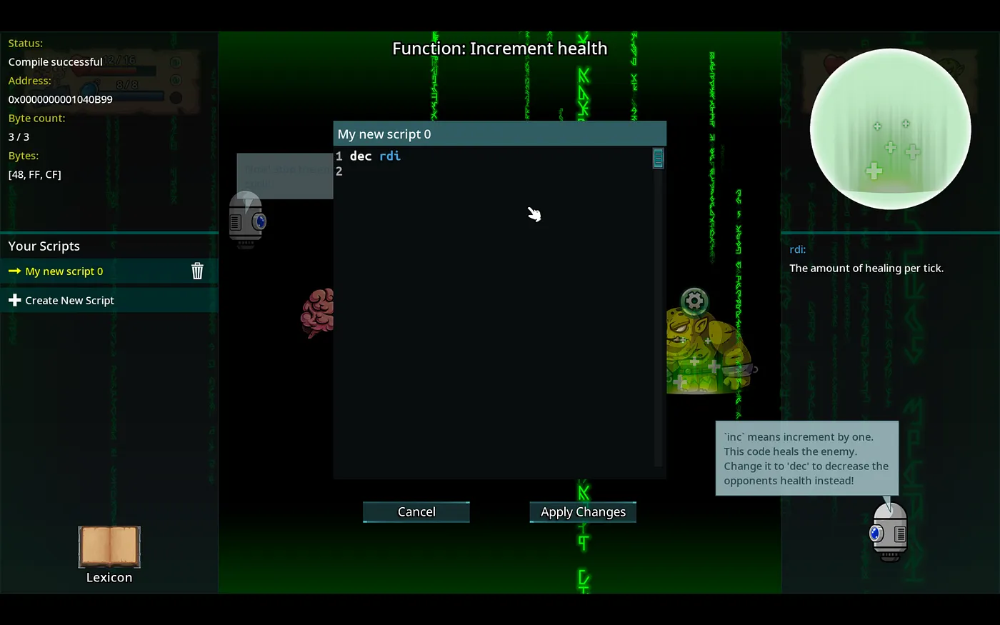

# How We Wrote a Self-Hacking Game in C++
I’ve been hard at work on Squally, a game in C++ to teach hacking. However, this creates a small problem: If we want to publish the game on Steam, then we can’t force people to download hacking tools first. Our solution? Put the tools inside the game, and let the game hack itself.


This had another unintended consequence. If the game hacks itself, then we need some low-level control over the game — and for that, we need a low-level language. C# and Unity were no longer an option, so we had to start looking at some C++ options.

We narrowed it down to two options. The first option we considered was Unreal Engine. Unfortunately, this engine is not very great for 2D games. Also, Unreal takes 5% of game revenues, which does not make sense if it does not add value. For these reasons, we settled on a lesser known engine called Cocos2d-x.

To emulate real hacking tools, there are only two things that we needed. First, a disassembler for converting the raw machine code into human-readable x86 assembly (or at least hacker-readable). The second thing we need is an assembler to do the opposite.

With these two tools, we effectively have a game that can read and write its own code. We just have to tell the game exactly where to look, which we will explore later.



Reversing a healing spell in Squally, by changing `inc` to `dec`.
Of course by letting users rewrite the code in assembly, the user can easily crash this game! But as any hacker knows, crashing things is just part of the job.

However, there are some cool ways to mitigate this. One option is to save the state of the program (registers/stack) before the hackable region of code, and restore it after it executes to prevent silly mistakes.

For those who like to live a bit more dangerously, there are libraries for ignoring segfaults and other errors, which is pretty frightening. This is no match for a simple `jmp 0x00000000`, but it may be good start for easing some of the inevitable frustration of an aspiring assembly programmer.

Now for the nitty gritty details. A completed sample project is located here: https://github.com/Squalr/SelfHackingApp

To accomplish our goal, we leverage three libraries:
AsmTK + AsmJit for assembling: https://github.com/asmjit/asmtk+ https://github.com/asmjit/asmjit
UDIS86, a disassembler: https://github.com/vmt/udis86

One might expect the steps are as follows:

Find instruction(s) we wish to edit
Disassemble them into x86/x64 assembly instructions, as strings.
Modify those strings, and assemble them back into raw bytes.
Write those bytes back to memory, overwriting the original instructions
This seems reasonable, except when we try it… the program crashes.

Get Zachary Canann’s stories in your inbox
Join Medium for free to get updates from this writer.

Enter your email
Subscribe
Upon digging deeper, it turns out that the protections for the page of memory that contain the code is marked as `Execute` only. It needs to be readable and writable. In Windows, this can be done using the `VirtualProtect` function in `windows.h`. In Unix, this is done via `mprotect`.

```
void HackUtils::setAllMemoryPermissions(void* address, int length)
{
#ifdef _WIN32
	DWORD old;
	VirtualProtect(address, length, PAGE_EXECUTE_READWRITE, &old);
#else
	// Unix requires changing memory protection on the start of the page, not just the address
	size_t pageSize = sysconf(_SC_PAGESIZE);
	void* pageStart = (void*)((unsigned long)address & -pageSize);
	int newLength = (int)((unsigned long)address + length - (unsigned long)pageStart);

	mprotect(pageStart, newLength, PROT_READ | PROT_WRITE | PROT_EXEC);
#endif
}
```

The next problem we need to solve is finding code we want to be able to assemble and disassemble. To solve this, we place markers around sections we want to be hackable, as done below.

```

NO_OPTIMIZE
int hackableRoutineTakeDamage(int health, int damage)
{
	// This is the code we want to be hackable by the user
	HACKABLE_CODE_BEGIN();
		health -= damage;
	HACKABLE_CODE_END();

	HACKABLES_STOP_SEARCH();

	if (health < 0)
	{
		health = 0;
	}

	return health;
}
END_NO_OPTIMIZE
```

The important features here are the `HACKABLE_CODE_BEGIN()` and `HACKABLE_CODE_END()` blocks. These emit a small sequence of useless x86 instructions.

Once we have these markers in place, we can grab a pointer to this function, and search for the markers! Everything in between these markers must be the code we want the user to be able to change.

For those interested in the implementation details of parsing, see theHackableCode class in the sample project.

Now that all technical problems are solved, we simply glue it all together! Below, we have created a function called `hackableRoutineTakeDamage()`. Notice the line health -= damage . This is the instruction we are going to self-modify.

In the runExampleHealth() function, we extract the hackable segments, and then patch the code with `hackableCode->applyCustomCode("nop")`.

As you might be able to guess, the second time we call `hackableRoutineTakeDamage()`, no health is subtracted! The health -= damage line has been effectively removed by self modifying code!

For those with a background in assembly, you may have noticed that 1 nop is far less bytes than the original instructions. The remaining bytes are filled with nop instructions automatically behind the scenes.

Hopefully you learned something, and if you’re interested in following our progress on our game, you can check out [Squally](https://store.steampowered.com/app/770200/Squally/) on Steam!

Looking for additional learning resources on game hacking? Check out content from our partner [Guided Hacking](https://guidedhacking.com/)!
